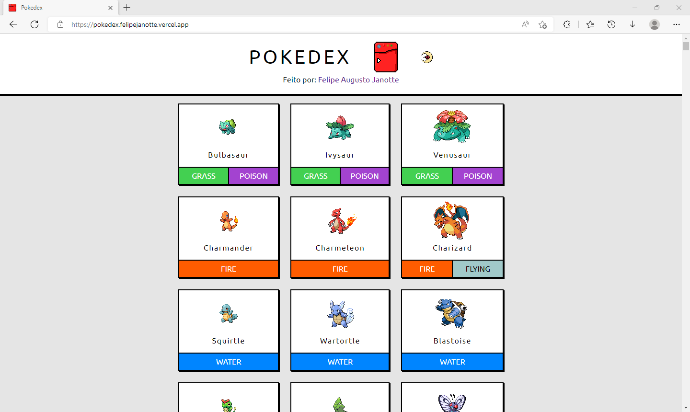
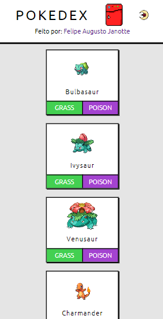
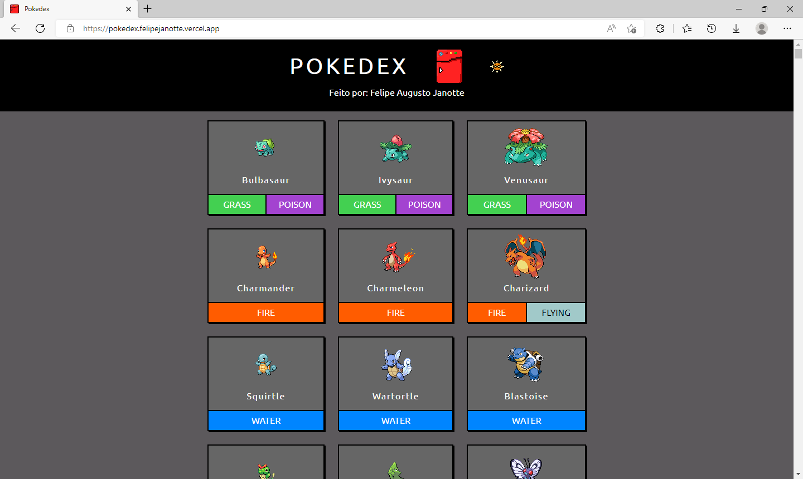
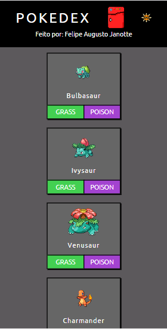

<h1>POKEDEX </h1>

## Sobre

Esse projeto é uma Pokedex (uma lista de pokemons[criaturas de um desenho japonês]), onde você pode ver os primeiros 905 pokemons (esse número foi limitado, pois existe milhares). O projeto teve o intuito inicial de consolidar conhecimentos de requisições HTTP, ReactTS, ContextAPI.

  <a href="https://pokedex.felipejanotte.vercel.app" target="_blank">CLIQUE AQUI PARA VISUALIZAR O SITE!</a>

## Tecnologias

- [x] HTML5 / CSS3
- - [x] Responsividade
- [x] HTTP Request
- [x] TypeScript
- [x] React
- - [x] ContextAPI

---

## Prints

<table>

  <thead>
    <tr>
      <th>TELA</th>
      <th>1440X1024</th>
      <th>425X820</th>
    <tr>
  </thead>

  <tbody>
    <tr>
      <td>CLARO</td>
      <td></td>
      <td></td>
    </tr>
    <tr>
      <td>ESCURO</td>
      <td></td>
      <td></td>
    </tr>
  </tbody>

</table>

